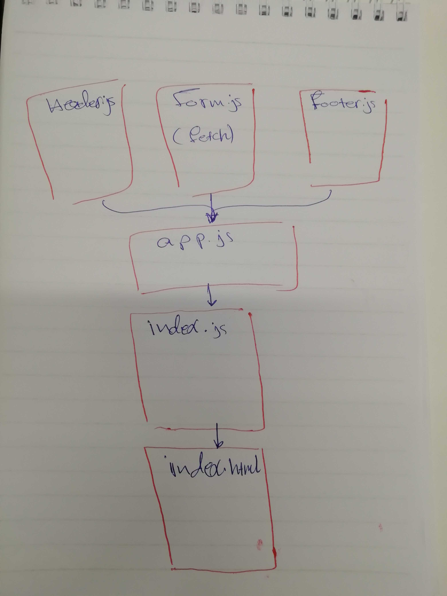

# # LAB - Class 28

## Project Name

### Author: Naseem

### Links and Resources

- [submission PR](https://github.com/naseem-401-advanced-javascript/lab-28)

### Setup

#### How to initialize/run your application (where applicable)

`npm start`

#### UML

